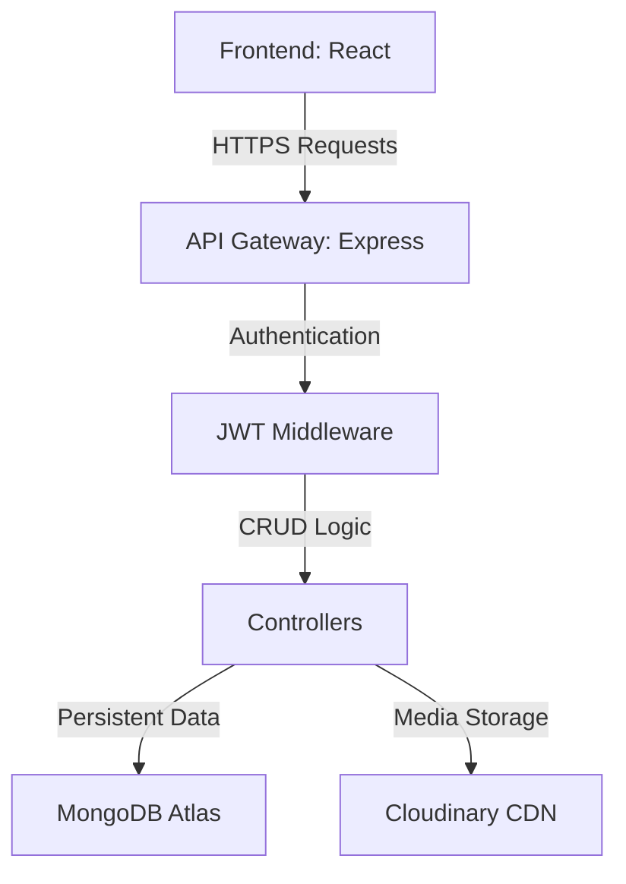

# 🚀 InsightFlare | Modern MERN Blogging Platform


**InsightFlare** is a high-performance, full-stack blogging application designed for creators. Built with the **MERN** ecosystem, it offers a seamless experience for writing, sharing, and engaging with content across diverse categories.

---

## ⚡ Key Features

-   **🔒 Secure Auth**: robust JWT-based authentication system with Bcrypt password hashing.
-   **📝 Rich Authoring**: Integrated **React-Quill** for a professional WYSIWYG writing experience.
-   **🖼️ Media Management**: Support for high-quality blog thumbnails and user avatars.
-   **💬 Engagement Deck**: Real-time **Likes**, **Dislikes**, and a dynamic **Comment Section**.
-   **📱 Responsive Layout**: Glassmorphic UI that feels premium on Desktop, Tablet, and Mobile.
-   **⚡ Live Preview**: Instant feedback during profile updates and post creation.

---

## 🛠️ Tech Stack

### Frontend
- **React.js (v18)** - Functional components & Hooks
- **React Router 6** - Declarative routing
- **Context API** - Global state management
- **Vanilla CSS** - Custom premium design system
- **SweetAlert2** - Elegant UI notifications

### Backend
- **Node.js & Express** - Scalable REST API architecture
- **MongoDB & Mongoose** - Schema-based data modeling
- **JWT (JSON Web Tokens)** - Stateless identity verification
- **Cloudinary (Integrated)** - Global CDN for media storage
- **Multer** - Efficient multipart/form-data handling

---

## 🏗️ Architecture



---

## 🚀 Quick Startup

### 1. Clone the repository
```bash
git clone https://github.com/sachinxsharma/BloggingWeb.git
cd BloggingWeb
```

### 2. Configure Environment `.env`
**Backend:**
```env
MONGO_URI=your_mongodb_uri
PORT=5000
JWT_SECRET=your_jwt_secret
CLOUDINARY_CLOUD_NAME=name
CLOUDINARY_API_KEY=key
CLOUDINARY_API_SECRET=secret
```

**Frontend:**
```env
REACT_APP_BASE_URL=http://localhost:5000/api
REACT_APP_ASSETS_URL=http://localhost:5000/uploads/
```

### 3. Run Locally
```bash
# In backend directory
npm install
npm run dev

# In frontend directory
npm install
npm run start
```

---

## 🎨 Design Philosophy
InsightFlare uses a **minimalist-tech** aesthetic. We prioritize whitespace, subtle gradients, and micro-interactions to ensure the reader's focus remains on the content while providing a premium feel.

---

## 👨‍💻 Author
**Sachin Sharma**
- [GitHub](https://github.com/sachinxsharma)
- [LinkedIn](https://linkedin.com/in/sachinsharma)

---

> [!TIP]
> This project is optimized for deployment on **Vercel** and **MongoDB Atlas**.
